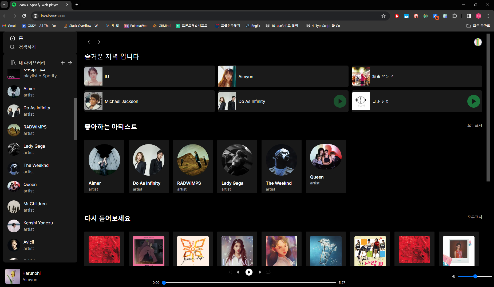
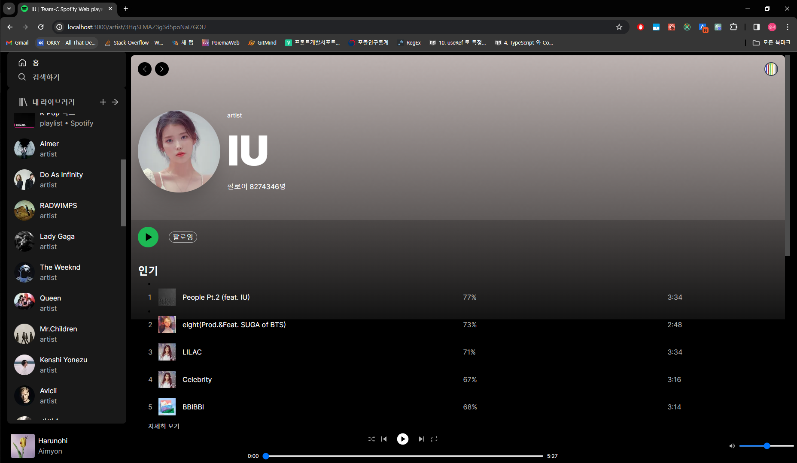
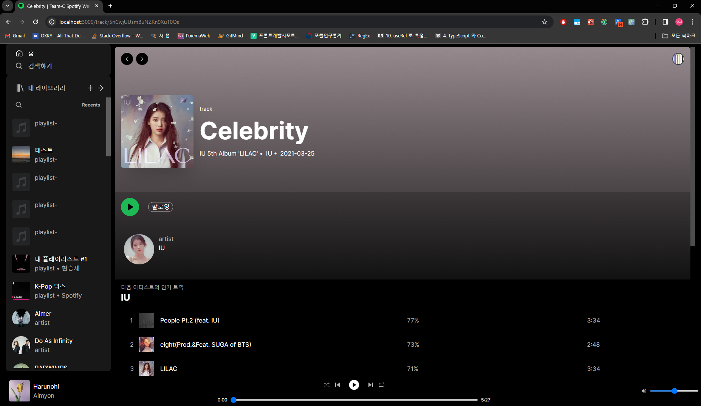
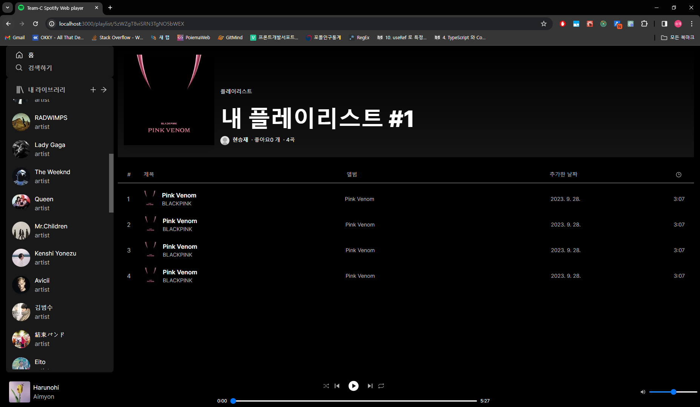
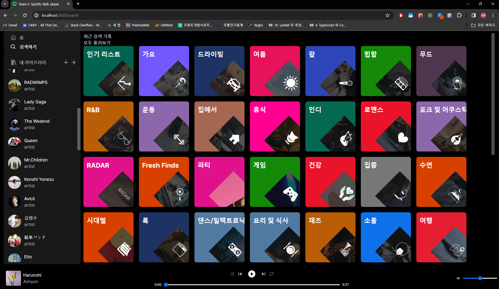

# Spotify Clone







음악 스트리밍 사이트 스포티파이 클론

**담당 업무**

- 프론트엔드 팀장
- 프로젝트 환경 셋 업
  - vite + webpack
  - nextjs
- spotify api를 활용하여 player sdk 제어
- redux store설계 및 rtk query api 작성
- msw 설정 및 api response data type 정의
- api 호출 컴포넌트 debounce 적용
- next-auth를 사용하여 spotify OAuth 적용

**사용 기술**

- NextJS, React, TypeScript, redux-toolkit, rtk-query, TailwindCSS NextAuth, MSW

🎯 **Trouble Shooting**

[Spotify clone <Banner/> 컴포넌트 refactoring](https://www.notion.so/Banner-refactoring-1b36158af1ff447893b52cd40e368fe7)

프로젝트를 진행하며 경험하고 체득한 부분

- 현시점 (2023.09)기준 NextJS app router환경에서 msw 와 rtk query가 작동하지 않는 이슈가 있었고 해당 라이브러리 github issue에 관리자가 남긴 현재 server component를 지원하지 않는 공지를 확인했고
  msw를 걷어내고 rtk-query를 client에서만 사용하게 되는 문제가 있었습니다. 그 후로 새로운 기술 스택을 도입할 때 해당 github issue와 현재 프로젝트 환경에 대한 호환성을 찾아보고 도입하게 되는 계기가 되었습니다.

- NextAuth를 사용하여 OAuth 로그인 개발을 경험

- 2023.11기준 msw next app router 지원 확인

- server component에서 compound component의 dot notation으로 컴포넌트를 렌더링하면 발생하는 이슈를 경험했습니다.
  ```tsx
  export default Object.assign(Navigation, {
    Brand: NavigationBrand,
    Content: NavigationContent,
    Item: NavigationItem,
    Link: NavigationLink,
    Portal: NavigationPortal,
    Segment: NavigationSegment,
  })
  ```
  같은 방식으로 사용할 수 있으나 권장하지 않는 방식인 것 같습니다.
